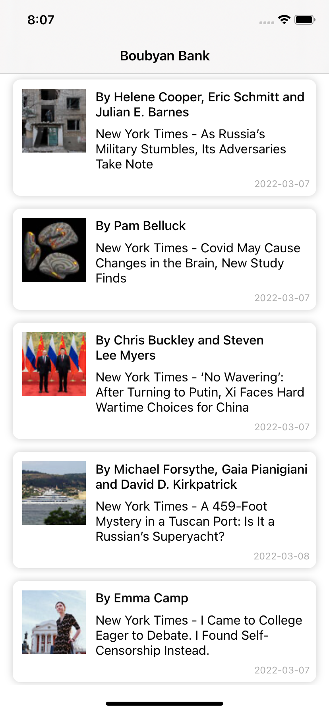
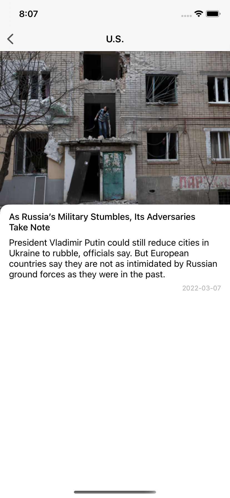
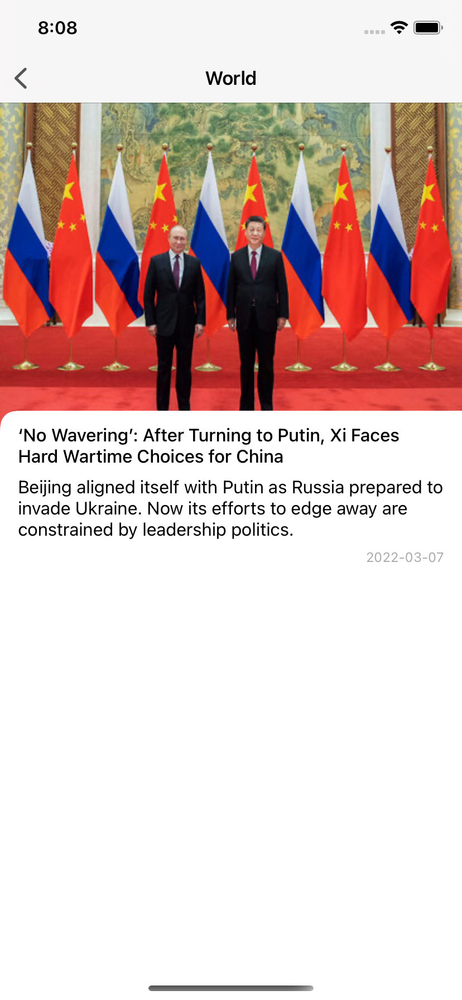

# Boubyan Bank Assignment - iOS Developer 

Assignment Requirement: Create a simple iOS mobile application that:

* The user is presented with NY Times a Most Popular Articles.
* Use this api (http://api.nytimes.com/svc/mostpopular/v2/viewed/{period}.json?api-key=sample-key)

## Key features: 

* Show loading indicator when articles api is calling.
* Show articles data after api is called.
* Show error message when problem happened.
* User can navigate article details.

## Demo

* [Google Drive ](https://drive.google.com/file/d/1CxlmrpZh91dtYNz_0AaQXlji3l583hcd/view?usp=sharing) 

## Screenshots

| Articles Loading View | Articles UI Data | Articles Details | Articles Details |
| --- | --- | --- | --- |
|  |  |  |  |


## Tech Stack

*  Swift 5
*  UIKit
*  Moya (networking layer)
*  MVVM architecture implement
*  Codable (Object mapping)

## Architecture

Clean Architecture with MVVM pattern in the presentation layer

## Setup

Download code or clone repo then navigate to code path and run 

```
pod install
```
